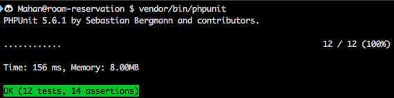

# Preview


# Run

```
mkdir ~/.data && cd ~/.data && mkdir mysql
composer docker-mysql && composer docker-phpmyadmin

composer install
composer dumpautoload -o

# to make DB
php artisan migrate:refresh

# install dependencies of nodejs
npm install

# run webpack with --watch
npm run dev

# production build of webpack
npm run build
```
# Test



To run the test you need to install phpunit or use the phpunit in the dependency directory by command below:
```
vendor/bin/phpunit -v --debug
```

## Support on Beerpay
Hey dude! Help me out for a couple of :beers:!

[](https://beerpay.io/mahanhaz/room-reservation)  [](https://beerpay.io/mahanhaz/room-reservation?focus=wish)